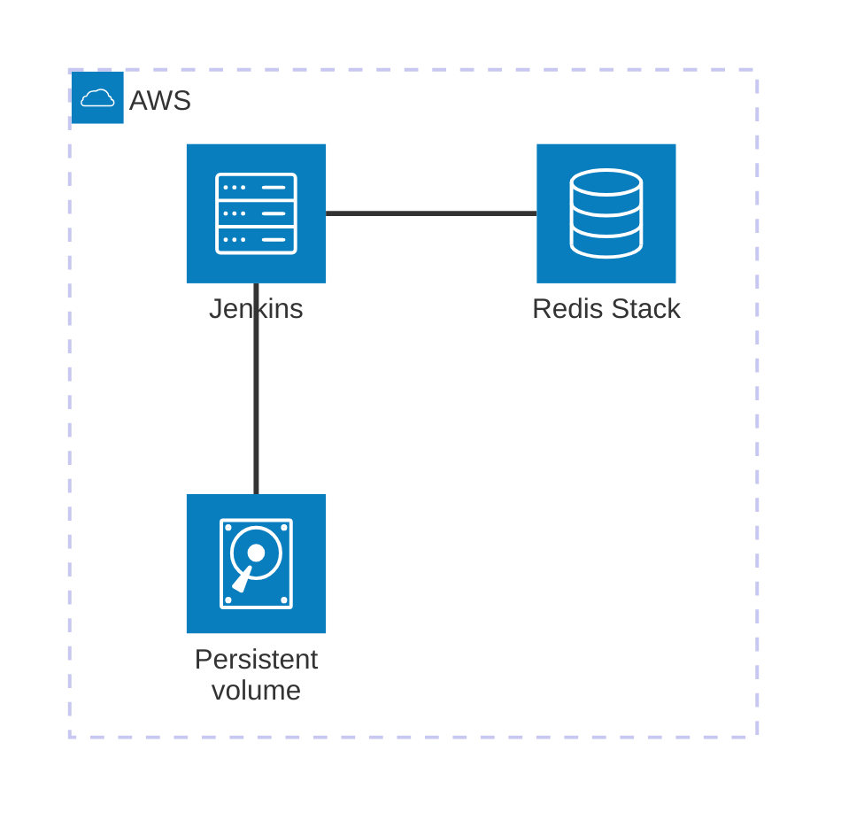

# CDK project for minimum Jenkins EC2 instance

This project constructs EC2 instance with the latest Jenkins and Redis Stack installed.
It contains the persistent EBS volume for Jenkins home and redis data directory.



## Usage

### First deploy

Enter your AWS Account ID in `bin/cdk-ec2-jenkins.ts`

```
new CdkEc2JenkinsCfnInstanceEbsStack(app, 'CdkEc2JenkinsStack', {
  env: {
    account: '[YourAWSAccountID]', region: '[YourAWSRegion]'
  }
});
```

Enter your PC's global IP address in the `incomingCIDR` variable in `cdk-ec2-jenkins-cfninstance-ebs-stack.ts`.
You can detect it at any IP address lookup site such as: https://iplocation.io/

```
export class CdkEc2JenkinsCfnInstanceEbsStack extends cdk.Stack {
  constructor(scope: Construct, id: string, props?: cdk.StackProps) {
        :
    const incomingCIDR = "[YourGlobalIPAddress]/32";

```

Enter the EC2 Instance name and KeyPair's name in `cdk-ec2-jenkins-cfninstance-ebs-stack.ts`.

```
    const cfnInstance = new ec2.CfnInstance(this, "CfnInstance", {
      tags: [{key: "Name", value: "[YourJenkinsInstanceName]"}],
        :
      imageId: machineImage.getImage(this).imageId,
      keyName: "[YourKeyPairName]",
        :
```

- Do deploy.

```
$ AWS_PROFILE=[YourAWSProfile] cdk synth
$ AWS_PROFILE=[YourAWSProfile] cdk deploy
```

Jenkins requires initial admin password. You can retrieve it with ssh:

```
$ ssh ec2-user@[PublicIPAddress] -i [YourKeyPair] sudo cat /var/lib/jenkins/secrets/initialAdminPassword
```

### Destroy the instance

```
$ AWS_PROFILE=[YourAWSProfile] cdk destroy
```

Persistent EBS volume remains not destroyed. You can make EBS snapshot with AWSCLIv2:

```
$ aws --profile [YourAWSProfile] ec2 create-snapshot --volume-id [VolumeID] --description "Jenkins Persistent snapshot" --tag-specifications 'ResourceType=snapshot,Tags=[{Key=Name,Value=jenkins-persistent-snapshot}]'
```

### Deploy with persistent snapshot

Deploy again with the existing persistent snapshot:

```
$ AWS_PROFILE=[YourAWSProfile] cdk deploy -c jenkinsPersistentSnapshotId=[SnapshotID]
```

### Use redis from Jenkins pipeline script

You can store JSON structure in Redis stack with JRedis Notifier plugin. (https://plugins.jenkins.io/redis-notifier/)
